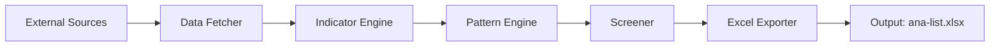

# Project Planning Document – Advanced Technical Screener

## Table of Contents
- [Project Planning Document – Advanced Technical Screener](#project-planning-document--advanced-technical-screener)
  - [Table of Contents](#table-of-contents)
  - [Overview](#overview)
  - [Glossary of Technical Terms](#glossary-of-technical-terms)
  - [Requirements](#requirements)
    - [Universe \& Data Sources](#universe--data-sources)
    - [Indicators \& Analytics (to compute for each equity)](#indicators--analytics-to-compute-for-each-equity)
    - [Screening Criteria (initial, configurable)](#screening-criteria-initial-configurable)
    - [Output \& Delivery](#output--delivery)
  - [Solution (Detailed Design)](#solution-detailed-design)
    - [Working Methods](#working-methods)
    - [Flowchart](#flowchart)
    - [Module \& File Layout](#module--file-layout)
    - [Core Classes \& Objects](#core-classes--objects)
    - [Data Model \& Fields](#data-model--fields)
    - [Screening Logic (initial defaults; configurable)](#screening-logic-initial-defaults-configurable)
    - [Excel Report Design](#excel-report-design)
    - [Environment \& Dependencies](#environment--dependencies)
  - [Testing \& Maintenance](#testing--maintenance)
    - [Testing Strategy](#testing-strategy)
    - [Maintenance Plan](#maintenance-plan)
  - [Open Tasks](#open-tasks)
  - [References](#references)
  - [System Architecture (Mermaid Diagram)](#system-architecture-mermaid-diagram)

---
## Overview
This document outlines the comprehensive plan for developing an advanced technical screener for equities based on multiple technical indicators, patterns, and risk metrics. The screener will analyze all constituents of the S&P 500 and Nasdaq-100 indices, compute a variety of technical indicators, identify chart patterns, and filter equities based on configurable criteria. The final output will be an Excel workbook summarizing the results.

## Glossary of Technical Terms

| Term | Definition |
|------|------------|
| **SMA (Simple Moving Average)** | Arithmetic mean of closing prices over a specified period (e.g., 50 or 200 days). |
| **RSI (Relative Strength Index)** | Momentum oscillator measuring speed and change of price movements; ranges from 0 to 100. |
| **MACD (Moving Average Convergence Divergence)** | Trend-following momentum indicator based on the difference between two EMAs (12 and 26) and a signal line (9 EMA of MACD). |
| **ATR (Average True Range)** | Volatility indicator showing the average range of price movement over a set period (commonly 14 days). |
| **Bollinger Bands** | Volatility bands placed above and below a moving average; typically ±2 standard deviations from a 20-day SMA. |
| **Beta** | Measure of a stock's volatility relative to the market (benchmark index); Beta > 1 indicates higher volatility than the market. |
| **Golden Cross** | Bullish signal where a short-term moving average (e.g., SMA50) crosses above a long-term moving average (e.g., SMA200). |
| **Support / Resistance** | Price levels where buying (support) or selling (resistance) pressure historically prevents further movement. |
| **Volatility** | Statistical measure of price dispersion, often calculated as the standard deviation of returns over a given period. |

## Requirements

### Universe & Data Sources
- **Equity universe:** All constituents of the **S&P 500** _and_ the **Nasdaq‑100** (deduplicated).
- Lists must be fetched **dynamically** at runtime from reputable sources (e.g., Wikipedia).
- **Market data:** Daily OHLCV time series fetched via a public data API (e.g., `yfinance`) for **≥ 1 year** to support crossovers, patterns, and 30‑day support/resistance windows.
- **Benchmark for Beta:** Use **SPY** (S&P 500 ETF) as the market proxy for beta calculation.

### Indicators & Analytics (to compute for each equity)
- **Trend & Momentum:**
  - `SMA50`, `SMA200` and **Golden Cross** detection (50‑day SMA crossing above 200‑day SMA).
  - `RSI(14)`.
  - **MACD (12‑26‑9)** (line & signal). 
- **Volatility & Range:**
  - **Bollinger Bands (20, ±2σ)**.
  - **ATR (14)**.
  - **Volatility:** Standard deviation of daily returns (configurable lookback, default 30 trading days).
- **Volume:**
  - 20‑day average volume vs. latest daily volume.
  - Flags for **unusual volume** (e.g., ≥ 2× 20‑day average).
- **Support / Resistance:**
  - **30‑day High/Low** windows; optional pivot‑based refinements.
- **Pattern Recognition:**
  - **Triangles** (ascending/descending/symmetric)
  - **Double Top / Double Bottom**.
  - **Channels** (up, down, horizontal).
- **Risk Metrics:**
  - **Beta** vs SPY using return regression.

### Screening Criteria (initial, configurable)
- **Golden Cross present** (`SMA50 > SMA200`) **and** the crossover confirmed on a specific date.
- `RSI(14)` in **[40, 70]**.
- **Volume spike:** Latest volume > 20‑day average.
- Optional: **MACD > signal**, price near upper **Bollinger** band, volatility constraints, and at least one recognized pattern.

### Output & Delivery
- **Excel workbook**: `ana-list.xlsx`.
  - **Summary sheet**: consolidated table for all pass candidates.
  - **Per‑equity sheets**: one sheet per passing symbol (ticker sanitized), with all computed fields.
  - **Charts**: dynamic Excel charts added **only in the final stage** of the pipeline (display layer).
- **Golden Cross log**: exact **crossover date** and the **SMA50/SMA200 values** on that date.
- All technical terms, diagrams, and in‑file comments: **English‑only**.

---

## Solution (Detailed Design)

### Working Methods

- **Modularity & Separation of Concerns**: Independent modules for data fetching, indicators, patterns, screening, and reporting.
- **Configuration‑driven**: Central `config.py` (or `config.yaml`) for tunables: lookbacks, thresholds, date ranges, pattern tolerances, output flags.
- **Deterministic runs**: Given the same input data & config, outputs are reproducible; random elements are avoided.
- **Robust data handling**: Missing days, holidays, splits/dividends (adjusted close), and symbol normalization (e.g., `BRK.B` → `BRK-B` for API compatibility).
- **Error handling**: Graceful degradation and retry logic for transient fetch failures; clear logging and metrics.
- **Performance & Parallelism**: Batched downloads, optional concurrency; caching recent results; rate‑limit awareness.
- **Quality Assurance**: Unit tests per indicator; integration tests for the end‑to‑end pipeline; validations against known references.
- **Versioning & CI**: Git‑based workflow, semantic versioning, automated checks, and artifacts (Excel report).
- **Security & Compliance**: Respect API ToS; avoid storing credentials/plain PII.
- **Documentation**: English‑only docstrings, in‑line comments, and diagrams.

---

### Flowchart 

```mermaid
flowchart LR
    A["Start"] --> B["Fetch tickers from Wikipedia"]
    B --> C["Merge S&P 500 + Nasdaq-100 lists (deduplicate)"]
    C --> D["Download historical data (yfinance)"]
    D --> E["Compute indicators: SMA50/200, RSI(14), MACD, Bollinger Bands, ATR, Volatility, Beta"]
    E --> F["Compute Support/Resistance (30-day High/Low)"]
    F --> G["Pattern Recognition: Triangles, Double Top/Bottom, Channels"]
    G --> H["Filter equities per criteria"]
    H --> I["Generate Excel report: Summary + per-equity sheets"]
    I --> J["Add dynamic Excel charts (final stage)"]
    J --> K["End"]
```

### Module & File Layout
- `main.py` — Orchestrates the pipeline (parse config → run steps → write outputs).
- `config.py` — Central configuration (lookbacks, thresholds, file paths, toggles).
- `data_fetcher.py` — Fetches index constituents (Wikipedia) and OHLCV via `yfinance`.
- `indicators.py` — Computes SMA, RSI, MACD, Bollinger, ATR, Volatility, Beta.
- `patterns.py` — Detects Triangles, Double Top/Bottom, Channels.
- `screening.py` — Applies screening logic; assembles pass list and metadata.
- `excel_report.py` — Builds `ana-list.xlsx` (summary + per‑equity sheets; charts added in final stage).
- `utils.py` — Common helpers (dates, symbol normalization, logging).
- `tests/` — Unit & integration tests (pytest‑style).

### Core Classes & Objects
- `StockData` (dataclass): symbol, raw OHLCV DataFrame, adjusted/derived fields.
- `IndicatorEngine`: methods to compute and attach indicators to `StockData`.
- `PatternEngine`: methods to identify and tag geometric patterns.
- `Screener`: encapsulates multi‑criteria filtering and candidate ranking.
- `ExcelExporter`: writes summary & per‑equity sheets; prepares chart ranges.

### Data Model & Fields
**Raw columns:** `Date`, `Open`, `High`, `Low`, `Close`, `Adj Close`, `Volume`.

**Derived columns (examples):**
- `SMA50`, `SMA200`.
- `RSI14`.
- `MACD`, `MACD_signal`, `MACD_hist`.
- `BB_mid(20)`, `BB_upper`, `BB_lower`.
- `ATR14`.
- `Volatility_30d` (std dev of daily returns).
- `Volume_20d_avg`, `Volume_spike_flag`.
- `Support_30d` (min Low), `Resistance_30d` (max High).
- `Beta_SPY`.
- `GoldenCross_date`, `GoldenCross_SMA50`, `GoldenCross_SMA200`.
- `Pattern_Triangle`, `Pattern_DoubleTop`, `Pattern_DoubleBottom`, `Pattern_Channel` (boolean + metadata).

### Screening Logic (initial defaults; configurable)
1. Golden Cross present and recorded.
2. `RSI(14)` ∈ [40, 70].
3. Latest `Volume` > `Volume_20d_avg` (spike flag).
4. Optional: `MACD > MACD_signal` and close ≥ `BB_mid` (or near `BB_upper`).
5. Optional: at least one pattern recognized (triangle/double/channel) and volatility within bounds.

### Excel Report Design
- **Workbook:** `ana-list.xlsx` (UTF‑8). 
- **Summary sheet columns (example):**
  - `Symbol`, `Index` (SP500/Nasdaq100), `LastClose`, `GoldenCrossDate`, `Cross_SMA50`, `Cross_SMA200`, `RSI14`, `MACD`, `MACD_signal`, `ATR14`, `Volatility_30d`, `Beta_SPY`, `Volume`, `Volume_20d_avg`, `Support_30d`, `Resistance_30d`, `PatternFlags`, `Notes`.
- **Per‑equity sheet:** raw OHLCV + all derived columns; standardized column order; frozen header row.
- **Charts (final stage):**
  - **Price panel:** Close, SMA50, SMA200; marker at Golden Cross date.
  - **RSI panel:** RSI(14) with 40/70 bands.
  - **Volume panel:** daily volume + 20‑day average.
  - **MACD panel:** MACD/Signal/Histogram.
  - **Bollinger panel:** Close with upper/lower bands.

### Environment & Dependencies
- **Python** ≥ 3.10; packages:
  - `pandas`  
  - `numpy`  
  - `yfinance`  
  - `openpyxl`  
  - `xlsxwriter`  
  - `matplotlib`  
  - `scipy`  
  - `statsmodels` (optional for OLS/robust beta).
- **Runtime constraints:** API rate limits; stable internet; handle retries and back‑off.

---

## Testing & Maintenance

### Testing Strategy
- **Unit tests (indicators):** numerical accuracy against known formula outcomes; tolerances for floating‑point error.
- **Unit tests (patterns):** synthetic price series with known shapes (triangles/doubles/channels) to validate detection.
- **Integration tests:** end‑to‑end pipeline over a small subset (e.g., 10 symbols) producing a stable Excel workbook.
- **Performance tests:** timing for full universe (SP500 ∪ Nasdaq100); memory usage; parallel download stability.
- **Regression tests:** pin sample datasets to detect unintended changes.

### Maintenance Plan
- **Constituent refresh:** re‑fetch index members weekly; detect additions/removals.
- **Config reviews:** quarterly tuning of thresholds (RSI range, volume spike multiplier, pattern tolerances).
- **Library updates:** monitor `yfinance` release notes; pin versions to avoid breaking changes.
- **Data quality monitoring:** dashboards and logs for missing data, extreme values, or failed fetches.

---

## Open Tasks
| ID | Task | Description |
|----|------|-------------|
| OT‑01 | Wikipedia scraping | Implement resilient scraping/parsing for S&P 500 and Nasdaq‑100 tables; sanitize tickers (`.`→`-`). |
| OT‑02 | Symbol deduping | Merge universes and remove duplicates; track `Index` membership (SP500, Nasdaq100, or both). |
| OT‑03 | Data fetcher | Batch OHLCV downloads with retry & back‑off; cache recent results. |
| OT‑04 | Indicator engine | Implement SMA, RSI(14), MACD(12‑26‑9), Bollinger(20,2), ATR(14), Volatility(30d), Beta(SPY). |
| OT‑05 | Golden Cross | Detect, record exact date & values; optional persistence filter to reduce whipsaws. |
| OT‑06 | Volume filters | Compute 20‑day average and spike flags (≥ 2× avg, configurable). |
| OT‑07 | Support/Resistance | Compute 30‑day High/Low; consider pivots for refinement. |
| OT‑08 | Pattern engine | Algorithms for triangles, double top/bottom, and channels; expose metadata. |
| OT‑09 | Screener | Compose multi‑criteria filtering; produce ranked candidate list. |
| OT‑10 | Excel exporter | Build `ana-list.xlsx`: summary + per‑equity sheets; consistent column order & formatting. |
| OT‑11 | Charts (final stage) | Add dynamic Excel charts to per‑equity sheets; ensure performant workbook size. |
| OT‑12 | Tests | Unit/integration/performance/regression tests; CI pipeline. |
| OT‑13 | Logging & metrics | Structured logs; error counters; simple health dashboard. |
| OT‑14 | Config & CLI | Central config + command‑line args (date range, universe, output path). |
| OT‑15 | Docs | Expand README and in‑code documentation; English‑only technical terminology. |

---

## References
- **S&P 500 constituents (Wikipedia):** [List of S&P 500 companies]
- **Nasdaq‑100 overview (Wikipedia):** [Nasdaq‑100]
- **FINVIZ Technical Analysis – Introduction:** [Technical Analysis – Introduction]
- **FINVIZ Charts & Patterns:** [Technical Analysis – Chart & Patterns]
- **yfinance documentation:** [yfinance GitHub]
- **Pandas documentation:** [Pandas Documentation]
- **Excel charting with openpyxl/xlsxwriter:** [openpyxl Charts], [XlsxWriter Charts]

## System Architecture (Mermaid Diagram)

