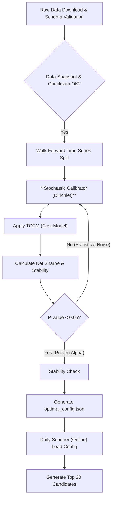

# Project Planning Document – "The Alpha Scanner"

## Table of Contents

- [Overview and Core Principles](#1-overview-and-core-principles)
- [System Philosophy and Guiding Principles](#2-system-philosophy-and-guiding-principles)
- [Technical Glossary](#3-technical-glossary)
- [Core Requirements and Technical Specification](#4-core-requirements-and-technical-specification)
- [Transaction Cost, Slippage, and Capacity Model (TCCM)](#5-transaction-cost-slippage-and-capacity-model-tccm)
- [Solution Architecture and Data Flow](#6-solution-architecture-and-data-flow)
- [Testing, Quality Assurance (QA), and Risk Management](#7-testing-quality-assurance-qa-and-risk-management)
- [The Final Deliverable: Decision-Making Dashboard](#8-the-final-deliverable-decision-making-dashboard)
- [Implementation Roadmap](#9-implementation-roadmap)
- [Technology Stack and Dependencies](#10-technology-stack-and-dependencies)

---

### 1. Overview and Core Principles

"The Alpha Scanner" system is an institutional-grade, autonomous platform designed to generate clean, statistically proven "alpha" (trading edge) that survives market friction. The system's philosophy champions the principle of **stability, significance, and risk-adjusted net profitability** over the theoretical maximization of returns.

**Core Principles of the System:**

| Core Principle          | Description                                                                                                                              |
| :---------------------- | :--------------------------------------------------------------------------------------------------------------------------------------- |
| **Statistical Significance** | Every optimal parameter must pass a rigorous Bootstrap test (P-value < 0.05). Trading will not be based on overfitting.              |
| **Real Cost Measurement**  | Implements a Transaction Cost & Capacity Model (TCCM) that calculates slippage as a function of liquidity and order size.            |
| **Global Search**         | Utilizes Dirichlet Sampling to explore the parameter space randomly, intelligently, and more efficiently.                              |
| **Quality Control (Governance)** | An extensive QA infrastructure that includes simulations of extreme market regimes (e.g., liquidity crisis).                      |

---

### 2. System Philosophy and Guiding Principles

The architecture of the Alpha Scanner is based on several guiding principles intended to ensure data-driven, risk-aware, and realistic decision-making.

| Guiding Principle                          | Implementation and Rationale                                                                                                                                                                     |
| :----------------------------------------- | :----------------------------------------------------------------------------------------------------------------------------------------------------------------------------------------------- |
| **Prioritizing Stability Over Gross Returns** | **Implementation:** The system's objective function is to maximize the **net, Cost-Adjusted Sharpe Ratio**.   **Rationale:** Priority is given to stability and risk-adjusted performance after deducting all real-world costs and fees, not to theoretical gross returns. |
| **Rigorous Statistical Validation**         | **Implementation:** The validation process combines Walk-Forward, Bootstrap Testing, and Cross-Validation methods.   **Rationale:** Prevents overfitting bias by creating thousands of alternative market histories and verifying that the results are not coincidental. |
| **Proactive Risk Management**               | **Implementation:** Utilizes **Volatility Targeting** to determine position size.   **Rationale:** Allocates capital to ensure that each position contributes an equal amount of risk (Risk Parity) to the overall portfolio, instead of allocating a fixed dollar amount. |
| **Data Standardization**                    | **Implementation:** **Rank Normalization** of all factors used in the analysis.   **Rationale:** Ensures that all indicators "speak the same language" and prevents the disproportionate influence of single outlier values. |

---

### 3. Technical Glossary

| Term                    | Definition                                                                                                                                                           |
| :---------------------- | :------------------------------------------------------------------------------------------------------------------------------------------------------------------- |
| **Dirichlet Sampling**  | A multi-dimensional probabilistic sampling method used to generate thousands of different weight combinations (which always sum to 1.0) to efficiently cover the entire optimization space. |
| **Bootstrap Testing**   | A statistical method for estimating the significance of returns. It tests the probability that the achieved result was due to chance (P-value).                     |
| **Slippage**            | The price loss caused by the difference between the desired price and the actual execution price. The model calculates this non-linearly.                                |
| **Volatility Targeting**| A strategy for determining position size. The position is measured in risk units, not dollars, based on the stock's Average True Range (ATR).                         |
| **Schema Diff**         | A protection mechanism during the data loading phase. Any change in the structure of incoming data (column names, data types) is identified as a failure and halts the run. |
| **Market Impact Cost (MIC)** | The cost incurred by the execution of the order itself, which pushes the price against the desired direction. This is a key component of the Slippage model. |
| **Cross-Validation**    | A validation technique where the training set is divided into multiple subsets; the model is trained on one part and validated on another (K-Fold Time Series CV). |

---

### 4. Core Requirements and Technical Specification

#### A. Data Architecture and Trading Universe

- **Target Universe**: S&P 500 and Nasdaq-100 stocks (filtering for less liquid assets).
- **Data Governance Model**:
  - **Data Snapshot**: Every data download (Raw Data) is saved to a separate file with a unique timestamp and a hash (Checksum), allowing for precise point-in-time restoration.
  - **Schema Diffing**: Rigid validation of data types (prices = float32, volume = int64).
  - **Survivorship Bias Handling**: Backtesting must be performed on data that includes delisted stocks to prevent a false positive bias.

#### B. Optimization Layer (`Calibrator.py`)

This is the learning core of the system.

- **Phase 1 – PoC Calibrator (Simple & Efficient)**  
  - **Search Method**: A small, fixed set of manually defined weight vectors (e.g., equal-weight, RS‑tilted, Trend‑tilted, Momentum‑tilted).  
  - **Logic**: For each candidate weight vector, compute a composite score from the rank-normalized factors, build positions via Volatility Targeting, run a single backtest (with optional TCCM), and evaluate basic metrics (net Sharpe, CAGR, max drawdown, hit‑rate).  
  - **Selection**: Choose the best-performing weight vector by cost‑adjusted Sharpe (subject to simple drawdown constraints) and save it into `optimal_config.json`.  
  - **Training Time Estimate**: ~10–20 backtests; with 5–10 years of S&P500+N100 data and a single machine, expected runtime is on the order of **2–10 minutes**.

- **Phase 2 – Full Production Calibrator (Dirichlet + Bootstrap)**  
  - **Search Method**: Hybrid: an initial coarse scan followed by thousands of Dirichlet‑sampled weight vectors that span the factor simplex.  
  - **Cost Function**: $Objective = \frac{E[R_{net}]}{\sigma(R_{net})}$, where $R_{net} = R_{gross} - Costs(Slippage, Commish)$, using the full TCCM.  
  - **Validation**: For each weight vector and walk‑forward segment, run backtests, compute net Sharpe, apply Bootstrap to estimate P‑values, and perform stability checks on rolling windows (e.g., positive net performance in ≥ 65% of windows).  
  - **Significance Gate**: Only weight vectors with P‑value < 0.05 and acceptable stability proceed.  
  - **Selection**: From the surviving candidates, choose the best‑performing weight vector(s) and write them to `optimal_config.json`.  
  - **Training Time Estimate**: With ~1,000 weight vectors, 5 walk‑forward segments, and vectorized Bootstrap (e.g., 200 resamples per segment), end‑to‑end training is expected to take roughly **1–4 hours** on a single machine (depending on parallelism and implementation efficiency).

#### C. Level 1: Market Regime - Kill Switch

A dynamic "kill switch" mechanism:

- **Entry/Exit Condition**: The system will prevent new positions if `Sector_Drop(1W) > Max(2*ATR, 1.5*Historical_Volatility_StdDev)`.
- **Logic**: Uses long-term volatility as a multiplier, adapting the kill switch's sensitivity to panic situations or sideways markets.

#### D. Levels 2 & 3: Score Aggregation and Alpha

- All alpha factors (RS, Squeeze, Trend, Momentum, Volume) undergo Rank Normalization (Quantile Transform) so that each factor lives on a comparable scale (e.g., \[-1.0, 1.0]).  
- **Technical Alpha Factors – Detailed Definitions**  
  - **RS (Relative Strength)**:  
    - Price performance vs S&P 500 (SPY) over multiple horizons (1M, 3M, 6M, 12M).  
    - Rank percentile vs the combined S&P 500 + Nasdaq‑100 universe.  
    - Sector‑relative performance vs the corresponding sector ETF (extension).  
  - **Squeeze**:  
    - Bollinger Bands vs Keltner Channels compression (BB width < KC width) to detect volatility contraction.  
    - Volatility ratio: current ATR (20‑day) vs long‑term ATR (252‑day).  
    - Range/ATR proxy (similar in spirit to ADX) for trend strength during a squeeze.  
  - **Trend (Aggregated Trend Factor)**:  
    - SMA 50 and SMA 200 (Golden/Death Cross signals via SMA 50 vs SMA 200).  
    - Distance of price from SMA 200 (% above/below).  
    - Slope of SMA 50 and SMA 200 over a recent window.  
    - Price vs short‑term SMA (e.g., SMA 20) to align short‑term with long‑term trend.  
    - All sub‑elements are combined into a single raw `Trend_raw` score, which is then rank‑normalized to `Trend_score`.  
  - **Momentum**:  
    - For Phase 1, implemented as a blend of short‑ and medium‑term Rate of Change (ROC) (e.g., 10‑day and 20‑day), yielding a unified `Momentum_score`.  
    - Phase 2 extension can add RSI, MACD, Stochastics, etc., re‑aggregated into the same single factor.  
  - **Volume**:  
    - Volume momentum/acceleration (e.g., ROC of volume).  
    - Volume vs moving‑average ratios (current volume vs 20‑day and 50‑day SMA of volume).  
    - Simple price‑volume divergence metric (price ROC vs volume ROC).  
    - Aggregated into a single `Volume_score`.

- **Factor Engine Architecture**  
  - Each alpha factor is implemented in its own module (`factors/rs.py`, `factors/trend.py`, `factors/squeeze.py`, `factors/momentum.py`, `factors/volume.py`), exposing a `compute_<factor>_score` function.  
  - A central `factor_engine.py` calls all factor modules, assembles raw factor values, and applies cross‑sectional rank normalization per date to produce `RS_score`, `Trend_score`, `Squeeze_score`, `Momentum_score`, and `Volume_score`.  
  - The resulting factor matrix (optionally augmented with LLM‑based fundamental/sentiment scores) is passed into `Calibrator.py` for weight optimization.

---

### 5. Transaction Cost, Slippage, and Capacity Model (TCCM)

**For Phase 1 (PoC / Stock Ranking):** TCCM is **optional**. If your goal is simply to rank and identify the top candidates without executing trades, you can disable transaction costs or set them to near-zero. The scanner will rank stocks based purely on technical factor scores.

**For Phase 2 (Production / Execution):** TCCM becomes **critical** and is integrated directly into the optimization's objective function to ensure realistic, net-of-cost performance expectations.

#### A. Slippage Formula

The calculated cost combines a fixed commission and market impact cost (MIC):

$$\text{Cost} = \text{Commission} + \text{Slippage}_{\text{MIC}}$$

Where:

$$\text{Slippage}_{\text{MIC}} = C \cdot \left( \frac{\text{Order Size}}{\text{Average Daily Volume}} \right)^\alpha \cdot \text{Volatility}$$

- $C$: Calibration Constant (e.g., 50 bps).
- $\text{Order Size}$: The dollar size of the order calculated by Volatility Targeting.
- $\text{Average Daily Volume (ADV)}$: 20-day average daily trading volume.
- $\alpha$: A non-linear impact factor (e.g., 0.75), ensuring that doubling the order size more than doubles the cost.
- $\text{Volatility}$: Daily volatility calculated by ATR (Average True Range).

#### B. Capacity and Liquidity Cap

- **The 1% Rule**: The system will flag any trade where the requested position size exceeds 1% of the stock's ADV.
- **Impact**: In case of a breach, a severe warning will be displayed, suggesting a reduction of the position size to prevent adverse impact on the execution price.

---

### 6. Solution Architecture and Data Flow

#### A. Data Flowchart (Robust Validation Loop)

The chart displays the validation and automatic configuration file update loop:

#### B. The Data Loader Process (`OT-02`)

| Step | Task                    | Input                 | Output/Notes                                               |
| :--- | :---------------------- | :-------------------- | :--------------------------------------------------------- |
| 1    | Download & Initial Save | Ticker list (S&P/Nasdaq) | Saves a Raw Parquet file with a unique timestamp.          |
| 2    | Integrity Check         | Raw Parquet file      | A Hash (Checksum) of the file to verify integrity.         |
| 3    | Schema Validation       | Raw Parquet file      | Strict check of data types (Dtype). Halts on failure.      |
| 4    | Data Cleaning           | Clean file            | Handles NaNs and removes tickers with >1% missing data.    |

---

### 7. Testing, Quality Assurance (QA), and Risk Management

The QA matrix is designed to cover execution and data risks:

| QA ID     | Test Type              | Test Description                                                        | Test Goal                                                                        |
| :-------- | :--------------------- | :---------------------------------------------------------------------- | :------------------------------------------------------------------------------- |
| **QA-01** | Cost Model Fidelity    | Run a simulation with Order Size = 10% of a non-liquid stock's ADV.     | Ensure that the slippage cost turns the Sharpe ratio negative, preventing the trade. |
| **QA-02** | Synthetic Regime Flip  | Simulate a scenario where the S&P 500 index drops 5% in one day.        | Ensure the Kill Switch mechanism is immediately activated and exposure drops to zero. |
| **QA-03** | Survivorship Injection | Inject 10 delisted tickers into the test data.                          | Ensure there is no positive survivorship bias in the backtest.                   |
| **QA-04** | Liquidity Shock        | Simulate a scenario where trading volume drops by 90% for one week.     | Ensure the TCCM adapts and limits position sizes accordingly.                    |
| **QA-05** | Determinism Test       | Verify that running `Calibrator.py` with the same random seed yields an identical output. | Essential for debugging and reproducing results.                                 |
| **QA-06** | Schema Change (Negative) | Change a column name in the incoming data from 'Volume' to 'VLM'.       | Ensure the Schema Diff mechanism halts the run immediately.                      |

**Integration Tests** (marked `@pytest.mark.integration`, require network connectivity):
- **yfinance connectivity**: Verify that `yfinance.download(...)` returns valid OHLCV data for test tickers (e.g., SPY, AAPL, MSFT).
- **Factor engine with real data**: Download live data, convert to internal format, and run `compute_factor_matrix` to ensure end-to-end compatibility.

---

### 8. The Final Deliverable: Decision-Making Dashboard

The final output is a `scanner_results_[DATE].xlsx` file, presenting a comprehensive overview of costs and risks.

#### Sheet 1: Top 20 Candidates (Cost-Adjusted)

| Field                 | Description                                                   |
| :-------------------- | :------------------------------------------------------------ |
| **Rank**              | Final rank 1-20 (sorted by weighted score).                   |
| **Ticker**            | The stock symbol.                                             |
| **Composite Score**   | The final weighted score (after normalization).               |
| **Vol_Adj_Shares**    | The exact number of shares to purchase (Volatility Targeted Position Size). |
| **Est_Entry_Price**   | The estimated entry price.                                    |
| **Est_Slippage_Cost** | The expected slippage cost (in dollars) for this position.    |
| **Capacity_Usage**    | The percentage of ADV required by the order (red if > 1%).    |
| **Significance**      | The P-value achieved in the Bootstrap Test.                   |

---

### 9. Implementation Roadmap

Breakdown of P0 and P1 tasks for implementation:

| ID         | Priority | Task                        | Detailed Description                                                  |
| :--------- | :------- | :-------------------------- | :-------------------------------------------------------------------- |
| **OT-01.1**| P0       | TCCM Implementation         | Write full Python functions for Slippage and Commission per the formula. |
| **OT-01.2**| P0       | QA Infrastructure           | Build the `tests/` library and implement the 6 critical tests (QA-01 to QA-06). |
| **OT-02.1**| P0       | Data Snapshot               | Develop a module for loading, saving Raw Parquet, and calculating Checksums. |
| **OT-02.2**| P0       | Schema Diff & Type Check    | Implement rigid schema checks (Dtypes) and the structural change kill switch. |
| **OT-03.1**| P1       | Dirichlet Engine            | Implement Dirichlet sampling for weight searching.                    |
| **OT-03.2**| P1       | Bootstrap & P-value         | Implement the full Bootstrap loop and set the P-value < 0.05 gate.    |
| **OT-04.1**| P1       | Rank Normalization          | Implement Quantile Transformation on all data.                        |
| **OT-04.2**| P1       | Volatility Targeting Sizing | Implement position size calculation based on ATR.                     |
| **OT-05**  | P2       | Reporter                    | Build the final Excel output and display cost/capacity metrics.       |

---

### 10. Technology Stack and Dependencies

- **Development Language**: Python 3.11+.
- **Core Libraries**:
  - `pandas`, `numpy`: For vectorized processing.
  - `scipy.stats`: For statistics (Dirichlet, Bootstrap).
  - `yfinance`: For data downloads.
  - `pyarrow`: For saving data in Parquet format.
  - `pytest`: For running the test suite.
- **Configuration Management**: All parameters will be saved in `optimal_config.json`, which will be updated automatically by the Calibrator after full validation.

