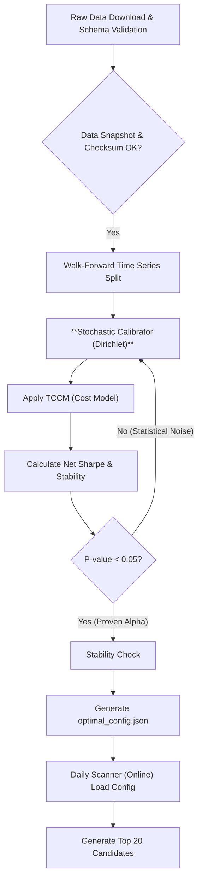

מסמך תכנון פרויקט – "The Alpha Scanner"

## תוכן העניינים

- סקירה כללית ועקרונות יסוד
- פילוסופיית המערכת ועקרונותיה המנחים
- מילון מונחים טכני
- דרישות ליבה ומפרט טכני
- מודל עלויות עסקה, החלקה וקיבולת (TCCM)
- ארכיטקטורת הפתרון וזרימת הנתונים
- בדיקות, אבטחת איכות (QA) וניהול סיכונים
- התוצר הסופי: דשבורד קבלת ההחלטות
- מפת דרכים ליישום (Implementation Roadmap)
- סביבה טכנולוגית ותלויות

---

### 1. סקירה כללית ועקרונות יסוד

מערכת "The Alpha Scanner" היא פלטפורמה אוטונומית ברמה מוסדית, המיועדת לייצר "אלפא" (יתרון מסחר) נקייה ומוכחת סטטיסטית, אשר שורדת את חיכוך השוק (Market Friction). פילוסופיית המערכת דוגלת בעקרון של **יציבות, מובהקות ורווחיות נטו מותאמת-סיכון** על פני מקסום תיאורטי של תשואות.

**עקרונות היסוד של המערכת:**

| עיקרון יסוד | תיאור |
| :--- | :--- |
| **מובהקות סטטיסטית** | כל פרמטר אופטימילי חייב לעבור מבחן Bootstrap קפדני (P-value < 0.05). אין מסחר על בסיס התאמת יתר (Overfitting). |
| **מדידת עלות אמיתית** | הטמעת מודל עלויות וקיבולת (TCCM) המחשב את ההחלקה (Slippage) כפונקציה של נזילות וגודל הפקודה. |
| **חיפוש גלובלי** | שימוש בדגימת דיריכלה (Dirichlet Sampling) כדי לחקור את מרחב הפרמטרים בצורה אקראית, חכמה ויעילה. |
| **בקרת איכות (Governance)** | תשתית QA מורחבת הכוללת סימולציות של משטרי שוק קיצוניים (למשל, משבר נזילות). |

---

### 2. פילוסופיית המערכת ועקרונותיה המנחים

הארכיטקטורה של Alpha Scanner מבוססת על מספר עקרונות מנחים שנועדו להבטיח קבלת החלטות מבוססת-נתונים, מודעת-סיכונים ומציאותית.

| עיקרון מנחה | יישום ורציונל |
| :--- | :--- |
| **העדפת יציבות על פני תשואה גולמית** | **היישום:** פונקציית המטרה של המערכת היא מקסום **יחס שארפ נטו (Cost-Adjusted Sharpe Ratio)**.   **הרציונל:** העדיפות ניתנת ליציבות וביצועים מותאמי-סיכון לאחר ניכוי כל העלויות והעמלות בפועל, ולא לתשואה גולמית תיאורטית. |
| **ולידציה סטטיסטית מחמירה** | **היישום:** תהליך האימות משלב שיטות Walk-Forward, Bootstrap Testing ו-Cross-Validation.   **הרציונל:** מניעת הטיית התאמת-יתר (Overfitting) על ידי יצירת אלפי היסטוריות שוק אלטרנטיביות ובדיקה שהתוצאות אינן מקריות. |
| **ניהול סיכונים פרואקטיבי** | **היישום:** שימוש ב-**Volatility Targeting** לקביעת גודל הפוזיציה.   **הרציונל:** הקצאת הון המבטיחה שכל פוזיציה תורמת מידה זהה של סיכון (Risk Parity) לתיק הכולל, במקום הקצאת סכום דולרי קבוע. |
| **סטנדרטיזציה של נתונים** | **היישום:** **נרמול דירוג (Rank Normalization)** של כל הפקטורים המשמשים לניתוח.   **הרציונל:** הבטחה שכל האינדיקטורים "מדברים באותה שפה" ומניעת השפעה לא-פרופורציונלית של ערכים קיצוניים בודדים. |

---

### 3. מילון מונחים טכני

| מונח | הגדרה |
| :--- | :--- |
| **Dirichlet Sampling** | שיטת דגימה הסתברותית רב-ממדית. משמשת ליצירת אלפי צירופים שונים של משקולות (שסכומן תמיד 1.0) כדי לכסות ביעילות את כל מרחב האופטימיזציה. |
| **Bootstrap Testing** | שיטה סטטיסטית לאמידת המובהקות של התשואות. בודקת את הסבירות שהתוצאה שהושגה היא מקרית (P-value). |
| **Slippage (החלקה)** | הפסד המחיר הנגרם מההפרש בין המחיר הרצוי למחיר הביצוע בפועל. המודל מחשב זאת באופן לא-ליניארי. |
| **Volatility Targeting** | אסטרטגיה לקביעת גודל הפוזיציה. הפוזיציה נמדדת ביחידות סיכון (Risk Units) ולא דולריות, בהתבסס על ממוצע הטווח האמיתי (ATR) של המניה. |
| **Schema Diff** | מנגנון הגנה בשלב טעינת הנתונים. כל שינוי במבנה הנתונים הנכנסים (שמות עמודות, סוגי נתונים) מזוהה ככשל ומעכב את הריצה. |
| **Market Impact Cost (MIC)** | העלות הנגרמת מעצם ביצוע הפקודה, המובילה לדחיפת המחיר נגד הכיוון הרצוי. זהו רכיב מרכזי במודל ה-Slippage. |
| **Cross-Validation** | טכניקת אימות שבה מערך האימון מחולק לתתי-קבוצות; המודל מאומן על חלק ומווליד על חלק אחר (K-Fold Time Series CV). |

---

### 4. דרישות ליבה ומפרט טכני

#### א. ארכיטקטורת נתונים ויקום מסחר

- **יקום יעד**: מניות S&P 500 ו-Nasdaq-100 (סינון של נכסים פחות נזילים).
- **מודל Data Governance**:
  - **Data Snapshot**: כל הורדת נתונים (Raw Data) נשמרת לקובץ נפרד עם חותמת זמן ייחודית ו-Hash (Checksum), המאפשר שחזור מדויק.
  - **Schema Diffing**: ולידציה קשיחה של סוגי הנתונים (מחירים = float32, נפח = int64).
  - **טיפול בהטיית הישרדות (Survivorship Bias)**: ה-Backtesting מתבצע על נתונים הכוללים מניות שנמחקו מהמסחר (Delisted) כדי למנוע הטיה חיובית כוזבת.

#### ב. שכבת האופטימיזציה (Calibrator.py)

זוהי הליבה הלומדת של המערכת.

- **פאזת 1 – Calibrator ל-PoC (פשוט ויעיל)**  
  - **שיטת חיפוש**: סט קטן וקבוע של וקטורי משקולות ידניים (למשל: משקל שווה, הטיה ל-RS, הטיה ל-Trend, הטיה ל-Momentum).  
  - **לוגיקה**: עבור כל וקטור משקולות מועמד, מחושב ציון קומפוזיט (Composite) על בסיס הפקטורים המנורמלים, נבנות פוזיציות על פי Volatility Targeting, מורץ Backtest יחיד (עם או בלי TCCM) ומחושבים מדדים בסיסיים (Sharpe נטו, CAGR, Max Drawdown, Hit-Rate).  
  - **בחירה**: נבחר וקטור המשקולות בעל ביצועי Sharpe נטו הטובים ביותר (תחת מגבלות Drawdown בסיסיות) ונשמר בקובץ `optimal_config.json`.  
  - **אומדן זמן אימון**: כ-10–20 Backtests; עבור 5–10 שנות נתוני יומי ל-S&P500+Nasdaq-100 על מכונה בודדת – סדר גודל של **2–10 דקות**.

- **פאזת 2 – Calibrator לפרודקשן (Dirichlet + Bootstrap)**  
  - **שיטת חיפוש**: היברידית – סריקת Grid גסה ולאחריה אלפי וקטורי משקולות מדוגמים מדיריכלה (Dirichlet) המכסים את מרחב המשקולות.  
  - **פונקציית עלות (Cost Function)**:  
    \($Objective = \frac{E[R_{net}]}{\sigma(R_{net})}$, כאשר $R_{net} = R_{gross} - Costs(Slippage, Commish)$\) תוך שימוש מלא ב-TCCM.  
  - **ולידציה**: עבור כל וקטור משקולות וכל סגמנט Walk-Forward, מורץ Backtest, מחושבים Sharpe נטו ומדדי סיכון, מתבצע Bootstrap לאמידת P-value ובדיקת יציבות על חלונות מתגלגלים (למשל, תשואה נטו חיובית ב-65% לפחות מהחלונות).  
  - **שער מובהקות (Significance Gate)**: רק וקטורי משקולות עם P-value < 0.05 ועמידוּת מספקת ממשיכים לשלב הבחירה.  
  - **בחירה**: מבין הוקטורים שעברו את הסינון נבחר הווקטור / קבוצת הוקטורים בעלי ביצועי Sharpe נטו הגבוהים ביותר ונכתבים ל-`optimal_config.json`.  
  - **אומדן זמן אימון**: לדוגמה, כ-1,000 וקטורי משקולות, 5 סגמנטים של Walk-Forward ו-200 דגימות Bootstrap לכל סגמנט – זמן האימון הכולל צפוי להיות בטווח של **1–4 שעות** על מכונה יחידה (תלוי במידת הפרלליות והיעילות).

#### ג. רמה 1: משטר שוק (Market Regime) - Kill Switch

מנגנון "מתג כיבוי" דינמי:

- **תנאי כניסה/יציאה**: המערכת תמנע כניסה לפוזיציות חדשות אם `Sector_Drop(1W) > Max(2*ATR, 1.5*Historical_Volatility_StdDev)`.
- **היגיון**: שימוש בתנודתיות ארוכת-טווח כגורם מכפיל, המתאים את רגישות מתג החירום למצבי פאניקה או שווקים צדדיים.

#### ד. רמה 2 ו-3: צבירת הניקוד והאלפא

- כל פקטורי האלפא (RS, Squeeze, Trend, Momentum, Volume) עוברים נרמול דירוג (Rank Normalization) – לדוגמה מיפוי אחוזוני לטווח \[-1.0, 1.0\] כך שכל פקטור נמצא על סקלת השוואה אחידה.  

- **פקטורי אלפא טכניים – הגדרות מפורטות**  
  - **RS (Relative Strength)** – כוח יחסי:  
    - ביצועי מחיר ביחס למדד S&P 500 (SPY) במספר אופקים: 1 חודש, 3 חודשים, 6 חודשים, 12 חודשים.  
    - דרגת אחוזון (Rank Percentile) ביחס ליקום כולו (S&P 500 + Nasdaq-100).  
    - השוואה סקטוריאלית (ביצועיות מול ETF סקטוריאלי רלוונטי) כהרחבה עתידית.  
  - **Squeeze** – דחיסת תנודתיות:  
    - השוואת רוחב Bollinger Bands לרוחב Keltner Channels (BB width < KC width → מצב דחיסה).  
    - יחס תנודתיות: ATR קצר (20 ימים) לעומת ATR ארוך (252 ימים).  
    - מדד טווח/ATR המשמש כפרוקסי לעוצמת מגמה בעת הדחיסה.  
  - **Trend (פקטור מגמה אגרגטיבי)**:  
    - ממוצעים נעים SMA 50 ו-SMA 200, כולל אותות Golden Cross / Death Cross (SMA 50 מעל/מתחת ל-SMA 200).  
    - מרחק המחיר מ-SMA 200 באחוזים (מעל/מתחת).  
    - שיפועי SMA 50 ו-SMA 200 על פני חלון זמן מוגדר.  
    - מחיר ביחס ל-SMA קצר (לדוגמה 20 ימים) כדי ליישר מגמה קצרת-טווח עם הארוכה.  
    - כל תתי-המדדים מחוברים לציון גולמי יחיד `Trend_raw`, אשר מנורמל בהמשך ל-`Trend_score`.  
  - **Momentum (מומנטום)**:  
    - בפאזת PoC: שילוב של Rate of Change קצר-טווח ובינוני (לדוגמה ROC ל-10 ימים ו-20 ימים) לציון מומנטום יחיד `Momentum_score`.  
    - בפאזת פרודקשן ניתן להרחיב למדדים נוספים כגון RSI, MACD, Stochastics, ולרכזם שוב לפקטור אחד.  
  - **Volume (נפח)**:  
    - מומנטום/האצה בנפח (ROC של Volume).  
    - יחס נפח לעומת ממוצע נע (Volume / SMA20, Volume / SMA50 של נפח).  
    - מדד התבדרות מחיר-נפח (Price ROC מול Volume ROC) לזיהוי מהלכים חלשים מבחינת השתתפות שוק.  
    - כל המרכיבים נאספים לציון `Volume_score` בודד.

- **ארכיטקטורת מנוע הפקטורים (Factor Engine)**  
  - כל פקטור מיושם במודול עצמאי: `factors/rs.py`, `factors/trend.py`, `factors/squeeze.py`, `factors/momentum.py`, `factors/volume.py`, כאשר כל מודול חושף פונקציה `compute_<factor>_score`.  
  - מודול מרכזי `factor_engine.py` קורא לכל מודולי הפקטורים, בונה DataFrame של ערכי פקטור גולמיים, ומבצע נרמול דירוג חוצה-סקטור (Cross-Sectional) לכל תאריך כדי לייצר את `RS_score`, `Trend_score`, `Squeeze_score`, `Momentum_score`, `Volume_score`.  
  - מטריצת הפקטורים (עם אפשרות להוספת ציוני LLM – פקטורים פונדמנטליים/סנטימנט) מוזנת ל-`Calibrator.py` לצורך אופטימיזציית המשקולות.  

---

### 5. מודל עלויות עסקה, החלקה וקיבולת (TCCM)

**עבור פאזת 1 (PoC / דירוג מניות):** TCCM הוא **אופציונלי**. אם המטרה היא רק לדרג ולזהות את המועמדים המובילים בלי לבצע עסקאות, ניתן להשבית את עלויות העסקה או להגדיר אותן כמעט-אפס. הסורק ידרג מניות על בסיס ציוני הפקטורים הטכניים בלבד.

**עבור פאזת 2 (פרודקשן / ביצוע):** TCCM הופך **קריטי** ומשולב ישירות בפונקציית המטרה של האופטימיזציה כדי להבטיח ציפיות ביצועים ריאליסטיות נטו-מעלויות.

#### א. נוסחת ההחלקה (Slippage)

העלות המחושבת משלבת עמלה קבועה (Commish) ועלות השפעת שוק (MIC):

$$\text{Cost} = \text{Commission} + \text{Slippage}_{\text{MIC}}$$

כאשר:

$$\text{Slippage}_{\text{MIC}} = C \cdot \left( \frac{\text{Order Size}}{\text{Average Daily Volume}} \right)^\alpha \cdot \text{Volatility}$$

- $C$: קבוע כוונון (Calibration Constant, נניח 50 bps).
- $\text{Order Size}$: גודל הפקודה הדולרי המחושב ע"י Volatility Targeting.
- $\text{Average Daily Volume (ADV)}$: נפח מסחר יומי ממוצע (20 ימים).
- $\alpha$: גורם השפעה לא-ליניארי (נניח 0.75), המבטיח שהכפלת גודל הפקודה מגדילה את העלות ביותר מפי שניים.
- $\text{Volatility}$: התנודתיות היומית המחושבת לפי ATR (Average True Range).

#### ב. מגבלת הקיבולת והנזילות (Capacity Cap)

- **חוק 1%**: המערכת תסמן כל עסקה שבה גודל הפוזיציה המבוקש עולה על 1% מה-ADV של המניה.
- **השפעה**: במקרה של חריגה, יוצג אזהרה חמורה ויוצע להקטין את גודל הפוזיציה למניעת פגיעה במחיר הביצוע.

---

### 6. ארכיטקטורת הפתרון וזרימת הנתונים

#### א. תרשים זרימת הנתונים (Robust Validation Loop)

התרשים מציג את לולאת הולידציה והעדכון האוטומטי של קובץ התצורה:

#### ב. תהליך ה-Data Loader (OT-02)

| שלב | משימה | קלט | פלט/הערות |
| :--- | :--- | :--- | :--- |
| 1 | Download & Initial Save | רשימת טיקרים S&P/Nasdaq. | שמירת קובץ Raw Parquet עם חותמת זמן ייחודית. |
| 2 | Integrity Check | קובץ Raw Parquet. | Hash (Checksum) של הקובץ לווידוא שלמות. |
| 3 | Schema Validation | קובץ Raw Parquet. | בדיקה קשיחה של סוגי הנתונים (Dtype). עצירה בכישלון. |
| 4 | Data Cleaning | קובץ נקי. | טיפול בחסרים (NaN) והסרת טיקרים עם יותר מ-1% נתונים חסרים. |

---

### 7. בדיקות, אבטחת איכות (QA) וניהול סיכונים

מטריצת ה-QA נועדה לכסות סיכוני ביצוע ונתונים:

| מזהה QA | סוג בדיקה | תיאור הבדיקה | מטרת הבדיקה |
| :--- | :--- | :--- | :--- |
| **QA-01** | Cost Model Fidelity | הרצת סימולציה עם Order Size = 10% מה-ADV של מניה לא-סחירה. | ודאות שעלות ה-Slippage הופכת את יחס השארפ לשלילי ומונעת את העסקה. |
| **QA-02** | Synthetic Regime Flip | סימולציה שבה מדד ה-S&P 500 צונח ב-5% ביום אחד. | ודאות שמנגנון ה-Kill Switch מופעל מיידית והחשיפה יורדת לאפס. |
| **QA-03** | Survivorship Injection | הזרקת 10 טיקרים שנמחקו מהמסחר לנתוני הבדיקה. | ודאות שאין הטיית הישרדות חיובית ב-Backtest. |
| **QA-04** | Liquidity Shock | סימולציה שבה נפח המסחר יורד ב-90% לשבוע אחד. | ודאות שמודל ה-TCCM מתאים את עצמו ומגביל את גודל הפוזיציות. |
| **QA-05** | Determinism Test | וידוא שהרצת Calibrator.py עם אותו Seed אקראי נותנת פלט זהה לחלוטין. | חיוני לדיבוג ולשחזור תוצאות. |
| **QA-06** | Schema Change (Negative) | שינוי שם עמודה בנתונים הנכנסים מ-'Volume' ל-'VLM'. | ודאות שמנגנון ה-Schema Diff עוצר את הריצה מיידית. |

**טסטים אינטגרטיביים** (מסומנים `@pytest.mark.integration`, דורשים חיבור רשת):
- **קישוריות yfinance**: אימות ש-`yfinance.download(...)` מחזיר נתוני OHLCV תקינים עבור טיקרים בודקים (למשל SPY, AAPL, MSFT).
- **מנוע פקטורים עם נתונים אמיתיים**: הורדת נתונים חיים, המרה לפורמט פנימי והרצת `compute_factor_matrix` כדי להבטיח תאימות end-to-end.

---

### 8. התוצר הסופי: דשבורד קבלת ההחלטות

התוצר הסופי הוא קובץ `scanner_results_[DATE].xlsx` המציג תמונת מצב מקיפה של עלויות וסיכונים.

#### גיליון 1: Top 20 Candidates (Cost-Adjusted)

| שדה | תיאור |
| :--- | :--- |
| **Rank** | דירוג סופי 1-20 (ממוין לפי ציון משוקלל). |
| **Ticker** | סימול המניה. |
| **Composite Score** | הציון המשוקלל הסופי (לאחר נרמול). |
| **Vol_Adj_Shares** | כמות המניות המדויקת לקנייה (Volatility Targeted Position Size). |
| **Est_Entry_Price**| המחיר המשוער לכניסה. |
| **Est_Slippage_Cost**| עלות ההחלקה הצפויה (בדולרים) לכניסה לפוזיציה זו. |
| **Capacity_Usage** | אחוז ה-ADV שהפקודה דורשת (אדום אם מעל 1%). |
| **Significance** | P-value שהושג ב-Bootstrap Test. |

---

### 9. מפת דרכים ליישום (Implementation Roadmap)

חלוקת משימות P0 ו-P1 ליישום:

| מזהה | עדיפות | משימה | תיאור מפורט |
| :--- | :--- | :--- | :--- |
| **OT-01.1** | P0 | מימוש TCCM | כתיבת פונקציות Python מלאות של Slippage ו-Commission לפי הנוסחה. |
| **OT-01.2** | P0 | תשתית QA | בניית ספריית tests/ והטמעת 6 הטסטים הקריטיים (QA-01 עד QA-06). |
| **OT-02.1** | P0 | Data Snapshot | פיתוח מודול לטעינה, שמירת Raw Parquet, וחישוב Checksum. |
| **OT-02.2** | P0 | Schema Diff & Type Check | יישום בדיקות סכמה קשיחות (Dtypes) ומיסוד ה-Kill Switch במקרה של שינוי מבני. |
| **OT-03.1** | P1 | Dirichlet Engine | יישום דגימת Dirichlet לחיפוש המשקולות. |
| **OT-03.2** | P1 | Bootstrap & P-value | יישום לולאת Bootstrap מלאה וקביעת שער ה-P-value < 0.05. |
| **OT-04.1** | P1 | Rank Normalization | יישום טרנספורמציית הקוונטיל על כל הנתונים. |
| **OT-04.2** | P1 | Volatility Targeting Sizing | יישום חישוב גודל הפוזיציה על בסיס ATR. |
| **OT-05** | P2 | Reporter | בניית הפלט הסופי (Excel) והצגת מדדי העלות והקיבולת. |

---

### 10. סביבה טכנולוגית ותלויות

- **שפת פיתוח**: Python 3.11 ומעלה.
- **ספריות ליבה**:
  - `pandas`, `numpy`: לעיבוד וקטורי.
  - `scipy.stats`: לסטטיסטיקה (Dirichlet, Bootstrap).
  - `yfinance`: להורדת נתונים.
  - `pyarrow`: לשמירת נתונים בפורמט Parquet.
  - `pytest`: להרצת מערך הבדיקות.
- **ניהול תצורה**: כל הפרמטרים יישמרו בקובץ `optimal_config.json`, שיעודכן אוטומטית על ידי ה-Calibrator לאחר ולידציה מלאה.

